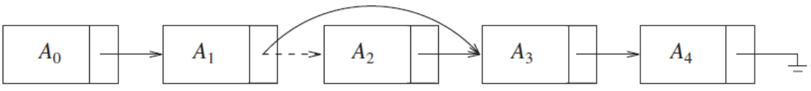

# Lecture 5: Abstract Data Type - List
The github for this page is:

https://github.com/itamames/Lecture5


The list can be defined as an abstract data type in which the elements are stored in an ordered manner for easier and efficient retrieval of the elements. List allows repetition, that means a single piece of data can occur more than once in a list. In the case of multiple entries of the same data, each entry of that repeating data is considered as a distinct item or entry. It is very much similar to the array but the major difference between the array and the list data structure is that the list size can be dynamically changed compared to static size arrays. Additionally, as a data structure, methods such as insert, delete and find are ussually implemented.


## List 
* linear sequence of an arbitrary number of items of the form A<sub>0</sub>, A<sub>1</sub>, A<sub>2</sub>, ..., A<sub>N-1</sub> 

## Important points:
* The size of this list is N.
* Empty list - special list of size 0.
* For any list (except the empty list) 
  * A<sub>i</sub> follows (or succeeds) A<sub>i-1</sub> (i < N),
  * A<sub>i-1</sub> precedes A<sub>i</sub> (i > 0). 
  * The position of element A<sub>i</sub> in a list is i. 

## ArrayList
Implements the List interface

https://docs.oracle.com/javase/7/docs/api/java/util/ArrayList.html

ArrayList acts like an array but the size of the ArrayList instance increases and decreases as necessary based on the number of elements in the data structure. 

When defining an array:
```java
int arr[]=new int[3];   //specified size of array is 3  
```
To increase its size, we need to create a bigger array:
```java
int[ ] newArr = new int[ arr.length * 2 ];
for( int i = 0; i < arr.length; i++ )
	newArr[ i ] = arr[ i ];
arr = newArr;

```
In Java, array and ArrayList are the well-known data structures. An array is a basic functionality provided by Java, whereas ArrayList is a class of Java Collections framework. It belongs to java.util package.

```java
import java.util.ArrayList;
// ArrayLists expand automatically when needed
public void doit()
{
       ArrayList<String> mylist = new ArrayList<String>();
       mylist.add("aaa");
       int size = mylist.size();  
        System.out.println("Array size= " + size + ", First element  = " +
                     mylist.get(0));   
  }  
```

## Complexity of Operations

What is the worst-case order of complexity for add on a list with n data values?

What is the worst-case order of complexity for remove on a list with n data values?

## Using Array implementation
* find is O(N) (worst case)
* printList is O(N)
* findKth is O(1)
* insert and remove – O(N) (worst case)

Example:
```java
L = new ArrayList<int>(34, 12, 52, 16, 12);
find(52) = 2
insert(27, 2)	returns L = (34,12, 27, 52, 16,12)
remove(52)	returns L = (34, 12, 27, 16, 12)
findKth(3) = 16
```

If insertions and deletions occur over the whole list, and in particular, at the front of the list, then the array implementation is not a good option. 

## Alternative - Linked List

https://docs.oracle.com/javase/7/docs/api/java/util/LinkedList.html

Linked List - consists of a collection of nodes, which are not necessarily adjacent in memory. 

Each node contains the element and a link to a node containing its successor (next link). The last cell’s next link references null.


```java
LinkedList ll = new LinkedList();  
```


## Important points:
* printList or find(x) is O(N) (start at the first node in the list and then traverse the list by following the next links);
* findKth - is no longer quite as efficient as an array implementation; 
* findKth(i) takes “O(i)" time and works by traversing down the list in the obvious manner.

## Remove and insert
* The remove method can be executed in one next reference change.



The insert method requires obtaining a new node from the system by using a new call and then executing two reference movements. 


## Special cases

* Add to the front or Remove the first item – O(1) time if a link to the front of the linked list is kept.

* Add at the end - O(1) time if we maintain a link to the last node.

Removing the last item is more complicated.

Solution: For every node maintains a link to its previous node in the list too. This is a *doubly linked list*.

## Doubly linked list


To add before: a new node containing x is spliced in between a node referenced by p and p.prev


```java
Node newNode = new Node(x, p.prev,p)
p.prev.next = newNode;
p.prev= newNode;
```

The logic of removing a node from a doubly linked list:


```java
p.prev.next = p.next;
p.next.prev= p.prev;
```

## Disadvantages

* Since there is an extra pointer in the doubly linked list i.e. the previous pointer, additional memory space is required to store this pointer along with the next pointer and data item.

* All the operations like addition, deletion, etc. require that both previous and next pointers are manipulated thus imposing operational overhead.


### Doubly Linked List implementation
```java

class DoublyLinkedList {    
    //A node class for doubly linked list
    class Node{  
        int item;  
        Node previous;  
        Node next;  
   
        public Node(int item) {  
            this.item = item;  
        }  
    }  
    //Initially, heade and tail is set to null
    Node head, tail = null;  
   
    //add a node to the list  
    public void addNode(int item) {  
        //Create a new node  
        Node newNode = new Node(item);  
   
        //if list is empty, head and tail points to newNode  
        if(head == null) {  
            head = tail = newNode;  
            //head's previous will be null  
            head.previous = null;  
            //tail's next will be null  
            tail.next = null;  
        }  
        else {  
            //add newNode to the end of list. tail->next set to newNode  
            tail.next = newNode;  
            //newNode->previous set to tail  
            newNode.previous = tail;  
            //newNode becomes new tail  
            tail = newNode;  
            //tail's next point to null  
            tail.next = null;  
        }  
    }  
   
//print all the nodes of doubly linked list  
    public void printNodes() {  
        //Node current will point to head  
        Node current = head;  
        if(head == null) {  
            System.out.println("Doubly linked list is empty");  
            return;  
        }  
        System.out.println("Nodes of doubly linked list: ");  
        while(current != null) {  
            //Print each node and then go to next.  
            System.out.print(current.item + " ");  
            current = current.next;  
        }  
    }  
}
class Main{
    public static void main(String[] args) {  
        //create a DoublyLinkedList object
        DoublyLinkedList dl_List = new DoublyLinkedList();  
        //Add nodes to the list  
        dl_List.addNode(10);  
        dl_List.addNode(20);  
        dl_List.addNode(30);  
        dl_List.addNode(40);  
        dl_List.addNode(50);  
   
        //print the nodes of DoublyLinkedList  
        dl_List.printNodes();  
    }  
}
```

## Collections API 
Is the set of classes and interfaces  in Java that implement commonly reusable collection data structures. Collections API resides in package java.util. 


Example of the most important parts of this interface:
```java
public interface Collection<AnyType> extends Iterable<AnyType>
	{
		int size( );
		boolean isEmpty( );
		void clear( );
		boolean contains( AnyType x );
		boolean add( AnyType x );
		boolean remove( AnyType x );
		java.util.Iterator<AnyType> iterator( );
	 }
```

The Collection interface extends the Iterable interface. 

Classes that implement the Iterable interface can have the enhanced for loop used on them to view all their items that uses an iterator.

## Iterator

Via the iterator method, each collection can create, and return an object that implements the Iterator interface and stores internally its notion of a current position.
```java
public interface Iterator<AnyType>
 {
    boolean hasNext( );
    AnyType next( );
    void remove( );
 }
 ```

The Collections that implements the Iterable interface must provide a method named iterator that returns an object of type Iterator defined in java.util.

Think of an iterator as pointing between two elements:
* Analogy: like the cursor in a word processor points between two characters 


```java
public static <AnyType> void print( Collection<AnyType> coll )
	 {
	    for( AnyType item : coll )
		  System.out.println( item );
	 }
```
When the compiler sees an enhanced for loop being used on an object that is Iterable, it mechanically replaces the enhanced for loop with calls to the iterator method to obtain an Iterator and then calls to next and hasNext. 

Thus the previously “print routine” is rewritten by the compiler as: 
```java
public static <AnyType> void print( Collection<AnyType> coll )
{
	Iterator<AnyType> itr = coll.iterator( );
  while( itr.hasNext( ) )
  {
    AnyType item = itr.next( );
    System.out.println( item );
  }
}
```

## Subset of the List interface in package java.util 
```java
public interface List<AnyType> extends Collection<AnyType>
{
        AnyType get( int idx );
        AnyType set( int idx, AnyType newVal );
        void add( int idx, AnyType x );
        void remove( int idx );
        ListIterator<AnyType> listIterator( int pos );
}
```

### Mathods 
* get and set  - to access or change an item at the specified position in the list, given by its index, idx. 
  * Index 0 - the front of the list,
  * Index size()-1 - the last item in the list,
  * Index size() - the position where a newly added item can be placed. 
* add – to add a new item in position idx (pushing subsequent items one position higher).
  * add at position 0 – add  at the front, 
  * add at position size() is adding an item as the new last item
* remove - similar as add
* listIterator method - ???


## Popular implementations of the List ADT.
		
### ArrayList

Advantages:
* get and set take constant time. 

Disadvantages
* insertion of new items and removal of existing items is expensive.

### LinkedList
Advantages
* adds and removes from the front of the list are constant-time operations.

Disadvantages
* is not indexable, so calls to get and set are expensive
* insertion of new items and removal of existing items is expensive. 


### Doubly LinkedList 
Advantages
* insertion of new items and removal of existing items is cheap. 
* adds and removes from the front of the list are constant-time operations.

Disadvantages
* is not indexable, so calls to get  and set are expensive


LinkedList and Doubly LinkedList have methods addFirst, removeFirst, addLast, removeLast, getFirst and getLast to efficiently add, remove, and access the items at both ends of the list.

### Examples:

Construct a List by adding items at the end.
```java
public static void makeList1( List<Integer> lst, int N )
{
         lst.clear( );
         for( int i = 0; i < N; i++ )
              lst.add( i );
}
```

For ArrayList or LinkedList  the running time of makeList1 is O(N) because each call to add, being at the end of the list is O(1) time (the occasional expansion of the ArrayList is safe to ignore).

Construct a List by adding items at the front.
```java
public static void makeList2( List<Integer> lst, int N )
{
        lst.clear( );
        for( int i = 0; i < N; i++ )
             lst.add( 0, i );
}
```
The running time is O(N) for a LinkedList, but O(N<sup>2</sup>) for an ArrayList, because in an ArrayList, adding at the front is an O(N) operation.


Compute the sum of the numbers in a List:
```java
public static int sum( List<Integer> lst )
{
        int total = 0;
        for( int i = 0; i < N; i++ )
            total += lst.get( i );
        return total;
}
```

sum is O(N) for an ArrayList, but O(N<sup>2</sup>) for a LinkedList, because in a LinkedList, calls to get are O(N) operations. 

# Class Practice


In this practice, you will build a class to implement a special array list that stores its values in increasing order. First, you will do this using the Java ArrayList class. Then you will do this using a class that implements an array list directly using an array. Remeber to work with your group member(s).

## EXERCISES
Clone the github link at the start of the class.

This project contains a CalendarDate class that models a calendar date with a month, day and year (e.g. 7/4/1776).
A CalendarDate implements the Comparable interface which requires it to have a compareTo method.

```text
Using the compareTo method: If we have two objects a and b that are Comparable, then the method call a.compareTo(b) returns a positive integer if a is "greater" than b, a negative integer if a is "less" than b, or 0 if they are the same. For dates, the comparison is based on chronological ordering.

Example: If a is the date 12/4/1967 and b is the date 6/29/1951, the expression a.compareTo(b) returns a positve integer since a comes after b chronologically. (That is, a is "greater" than b in time.)
```

1) Read through the compareTo method in the CalendarDate class and explain how it works to your lab partner(s).

2) Examine the Problem1Tester class. This class contains a main method that creates an ArrayList of CalendarDate objects. The goal is to add the dates so that the list is always sorted in chronological order after each insert. Complete the insert method to satisfy this goal.

    * HINT: Since the list should be sorted as you insert the next date, search for the correct insert point and then add the date there using the add method of the ArrayList class.

3) The OrderedArrayList class models an array list that always keeps its elements in sorted order without duplicates. The ordered array list is implemented using an array such that the entries in the list are stored in the array in increasing order in positions 0 to numData-1. 
    * Note that the class is defined such that the entries in the ordered array list must implement the Comparable interface so we can compare them using the compareTo method.

     Complete the add method that inserts the new entry into the correct place in the array so that the entries in the array are stored in increasing order. If the new entry is inserted into the array, return true. If the new entry is already in the array, do not change the array and return false. The user of this list doesn't have to search for the correct insert point to add the entry; this method will do the work.

4) Test your code with the supplied testers (CalendarDateTester and StringTester). Your method should work for calendar dates and strings and for any other Comparable objects. (Why? Look at the OrderedArrayList class and see how its generic type is defined.)
